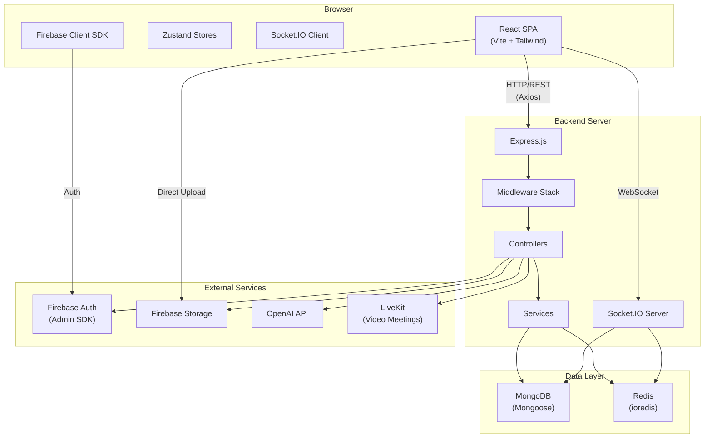

# TaMaD Complete Learning Knowledge Base — Part 1: Foundation

> **How to use these notes**: This is not a summary. This is a reverse-engineered teaching curriculum built from the actual TaMaD source code. Every file path, function name, route, and code snippet references something that actually exists in the repository at `d:\TaMaD`. Read sequentially for full understanding, or jump to specific sections when debugging or extending the project.

---

## 00 — How To Use These Notes

These notes are organized into a learning sequence. Each section builds on the previous one.

**If you want to understand a feature**, start with the architecture (Section 03), then find the relevant frontend page, trace to its store, follow the API call, then find the backend route → controller → model.

**If you want to debug something**, go to Section 34 (Debugging).

**If you want to add a feature**, go to Section 41 (Rebuild From Scratch) for the engineering sequence.

**If you want to study for interviews**, go to Sections 43–45.

---

## 01 — What TaMaD Is

### Problem It Solves

TaMaD is a **full-stack project management and team productivity platform**. It combines task management, project tracking, team collaboration, meetings, AI assistance, notes, goals, habits, files, analytics, and agile workflows into a single web application.

### Users

- Individual users managing personal productivity (tasks, habits, goals, notes)
- Teams collaborating on projects (workspaces, members, roles)
- Organizations with multiple teams

### Main Concepts

| Concept | What It Means in TaMaD | Where Defined |
|---------|----------------------|---------------|
| **Workspace** | The fundamental isolation boundary. Everything belongs to a workspace. | [Workspace.ts](file:///d:/TaMaD/backend/src/models/Workspace.ts) |
| **Personal Workspace** | Auto-created for every user on first login. Type = `'personal'` | [authController.ts](file:///d:/TaMaD/backend/src/controllers/authController.ts#L466-L473) |
| **Team Workspace** | Shared workspace linked to a Team. Type = `'team'` | [Workspace.ts](file:///d:/TaMaD/backend/src/models/Workspace.ts#L27) |
| **Project** | A container for related tasks within a workspace | [Project.ts](file:///d:/TaMaD/backend/src/models/Project.ts) |
| **Task** | The core work unit. Has status, priority, assignees, due dates, etc. | [Task.ts](file:///d:/TaMaD/backend/src/models/Task.ts) |
| **Sprint** | Agile time-box for organizing tasks | [Sprint.ts](file:///d:/TaMaD/backend/src/models/Sprint.ts) |
| **Epic** | Large feature/body of work containing multiple tasks | [Epic.ts](file:///d:/TaMaD/backend/src/models/Epic.ts) |
| **Team** | A group of users with roles and permissions | [Team.ts](file:///d:/TaMaD/backend/src/models/Team.ts) |
| **Meeting** | Video meetings powered by LiveKit | [Meeting.ts](file:///d:/TaMaD/backend/src/models/Meeting.ts) |
| **Organization** | Top-level entity containing multiple teams | [Organization.ts](file:///d:/TaMaD/backend/src/models/Organization.ts) |

### Major Features (actually implemented, verified from code)

1. **Task Management** — CRUD, drag-and-drop reorder, Kanban board, bulk operations, watchers, votes, comments, subtasks, dependencies
2. **Project Management** — Projects with status, health tracking, risk management, agile settings
3. **Agile/Scrum** — Sprints, epics, story points, Kanban board, sprint planning
4. **Notes** — Rich text notes per workspace
5. **Documents** — Document management
6. **Whiteboards** — Collaborative whiteboards
7. **Goals** — Goal tracking with progress
8. **Habits** — Habit tracking with streaks
9. **File Storage** — Upload to Firebase Storage with signed URLs
10. **Meetings** — LiveKit-powered video meetings (two implementations: original + TaMaD Meet)
11. **AI Assistant** — OpenAI-powered task parsing, natural language input, embeddings
12. **Notifications** — Real-time + persistent notifications
13. **Analytics** — Workspace analytics and reports
14. **Team Management** — Create teams, invite members, RBAC
15. **Calendar** — Calendar view of tasks
16. **Focus Sessions** — Pomodoro-style focus tracking
17. **Search** — Cross-entity search
18. **Roadmap** — Project roadmap view
19. **Templates** — Task/project templates
20. **Contact Form** — Public contact page
21. **Real-time Collaboration** — Socket.IO for live updates, presence, typing indicators

---

## 02 — Repository Structure

### Root Directory Layout

```
d:\TaMaD\
├── .agents/                    # Gemini agent skills (Firebase, etc.)
├── .env                        # Root environment variables (SECRETS - not committed)
├── .env.example                # Template for environment variables
├── .git/                       # Git repository data
├── .github/workflows/          # CI/CD pipeline definitions
│   ├── ci.yml                  # Main CI pipeline
│   └── ci-cd.yml               # CI/CD with deployment
├── .gitignore                  # Git ignore rules
├── .npmrc                      # npm/pnpm configuration
├── .vscode/                    # VS Code workspace settings
├── README.md                   # Project documentation
├── audit.log                   # Security audit log
├── backend/                    # Express.js API server
├── deploy.sh                   # Deployment script
├── deployment/                 # Production deployment configs
│   ├── backup/                 # Database backup scripts
│   └── docker-compose.prod.yml # Production Docker Compose
├── docker-compose.yml          # Single-node production Docker Compose
├── docker-compose.dev.yml      # Development Docker Compose
├── docker-compose.test.yml     # Testing Docker Compose
├── docker-compose.prod.yml     # Alt production Docker Compose
├── docs/                       # Documentation
│   ├── audit/                  # Security audit documents
│   ├── deployment/             # Deployment guides
│   ├── plan/                   # Feature planning docs
│   ├── release/                # Release notes
│   ├── tamad-meet/             # TaMaD Meet documentation
│   └── testing/                # Testing documentation
├── e2e/                        # Playwright end-to-end tests
│   ├── fixtures/
│   ├── pages/
│   └── tests/
├── firebase.json               # Firebase project configuration
├── firestore.indexes.json      # Firestore index definitions
├── firestore.rules             # Firestore security rules
├── frontend/                   # React + Vite SPA
├── functions/                  # Firebase Cloud Functions
├── genkit/                     # Google Genkit AI functions
├── package.json                # Root workspace package.json
├── playwright.config.ts        # Playwright E2E test config
├── pnpm-lock.yaml              # pnpm lockfile
├── pnpm-workspace.yaml         # pnpm workspace definition
├── skills-lock.json            # Agent skills lock
├── storage.rules               # Firebase Storage security rules
└── test-results/               # E2E test output
```

### Backend Structure (`d:\TaMaD\backend\src\`)

```
backend/src/
├── __tests__/                  # Unit/integration tests
│   ├── auth.test.ts
│   ├── health.test.ts
│   ├── helpers.ts
│   ├── projectController.test.ts
│   ├── taskController.test.ts
│   └── validation.test.ts
├── config/                     # Service connections
│   ├── db.ts                   # MongoDB connection
│   ├── firebase.ts             # Firebase Admin SDK init
│   └── redis.ts                # Redis connection
├── controllers/                # Request handlers (26 controllers)
│   ├── authController.ts       # Authentication & session management
│   ├── taskController.ts       # Task CRUD + reorder + bulk
│   ├── projectController.ts    # Project management
│   ├── meetingController.ts    # Meeting scheduling & management
│   ├── teamController.ts       # Team CRUD & member management
│   ├── workspaceController.ts  # Workspace CRUD & member management
│   ├── fileController.ts       # File metadata & signed URLs
│   ├── aiController.ts         # AI features (task parsing, embeddings)
│   ├── analyticsController.ts  # Dashboard analytics
│   ├── searchController.ts     # Cross-entity search
│   ├── notificationController.ts # Notification management
│   ├── habitController.ts      # Habit tracking
│   ├── goalController.ts       # Goal management
│   ├── noteController.ts       # Notes CRUD
│   ├── documentController.ts   # Document management
│   ├── commentController.ts    # Task comments
│   ├── categoryController.ts   # Category management
│   ├── tagController.ts        # Tag management
│   ├── portfolioController.ts  # Portfolio management
│   ├── milestoneController.ts  # Milestone management
│   ├── focusSessionController.ts # Focus/Pomodoro sessions
│   ├── agileController.ts      # Sprint & epic management
│   ├── dashboardController.ts  # Dashboard data
│   ├── organizationController.ts # Organization management
│   ├── whiteboardController.ts # Whiteboard CRUD
│   ├── health.controller.ts    # Health check endpoint
│   └── tamad-meet/             # TaMaD Meet controllers
├── gateways/                   # Socket.IO gateways
│   └── tamadMeetSocketGateway.ts
├── middleware/                  # Express middleware
│   ├── auth.ts                 # JWT authentication + role authorization
│   ├── workspaceAuth.ts        # Workspace membership verification
│   ├── teamAuth.ts             # Team membership + role verification
│   ├── cache.ts                # Response caching middleware
│   ├── validate.ts             # Zod schema validation
│   └── schemas.ts              # Zod validation schemas
├── models/                      # Mongoose schemas (37 models)
│   ├── User.ts, Task.ts, Project.ts, Workspace.ts, Team.ts, ...
│   └── tamad-meet/             # TaMaD Meet models
├── routes/                      # Express route definitions (28 routers)
│   ├── authRoutes.ts, taskRoutes.ts, projectRoutes.ts, ...
├── services/                    # Business logic services
│   ├── meetingService.ts
│   ├── meetingAutomationService.ts
│   ├── n8nService.ts
│   └── tamad-meet/
├── sockets/                     # Socket.IO handlers
│   ├── socketManager.ts        # Socket.IO server initialization
│   ├── socketAuth.ts           # Socket authentication middleware
│   ├── meetingSocket.ts        # Meeting socket events
│   └── rateLimiter.ts          # Socket rate limiting
├── types/                       # TypeScript type declarations
│   └── node-cron.d.ts
├── utils/                       # Utility functions
│   ├── ai.ts                   # OpenAI integration
│   ├── auditLogger.ts          # Audit trail logging
│   ├── cache.ts                # Redis cache wrapper + keys
│   ├── healthcheck.ts          # Health check utilities
│   ├── jobs.ts                 # Background cron jobs
│   ├── jwt.ts                  # JWT utilities
│   ├── logger.ts               # Winston logger
│   ├── mailer.ts               # Nodemailer email service
│   ├── performance.ts          # Performance monitoring
│   ├── redact.ts               # Connection string redaction
│   ├── security.ts             # Helmet, rate limiting, sanitization
│   ├── seed.ts                 # Database seeding (empty placeholder)
│   └── validateEnv.ts          # Environment variable validation
└── index.ts                     # Server entry point
```

### Frontend Structure (`d:\TaMaD\frontend\src\`)

```
frontend/src/
├── App.tsx                      # Root component with routing
├── main.tsx                     # React entry point
├── index.css                    # Global CSS (Tailwind v4)
├── components/
│   ├── ai/                     # AI assistant components
│   ├── auth/                   # Authentication UI components
│   ├── dashboard/              # Dashboard widgets
│   ├── landing/                # Landing page components
│   ├── layout/                 # App layout (Sidebar, TopBar, AppLayout)
│   │   ├── AppLayout.tsx
│   │   ├── Sidebar.tsx
│   │   ├── TopBar.tsx
│   │   └── WorkspaceSwitcher.tsx
│   ├── notes/                  # Notes-related components
│   ├── planner/                # Planner components
│   ├── projects/               # Project components
│   ├── tasks/                  # Task cards, modals, boards
│   ├── teams/                  # Team management components
│   ├── ui/                     # Reusable UI components (22 files)
│   │   ├── Button.tsx, Card.tsx, Dialog.tsx, Drawer.tsx, ...
│   │   ├── CommandPalette.tsx  # ⌘K command palette
│   │   ├── ErrorBoundary.tsx
│   │   ├── FileUpload.tsx
│   │   ├── Inspector.tsx       # Task/entity side panel
│   │   ├── QuickCreate.tsx     # Quick task creation
│   │   └── ShortcutsSheet.tsx  # Keyboard shortcuts reference
│   └── whiteboards/
├── hooks/
│   ├── useFileUpload.ts        # Firebase Storage upload hook
│   ├── useSocket.ts            # Socket.IO connection hook
│   ├── useTheme.ts             # Dark/light theme hook
│   └── useWebRTC.ts            # WebRTC for meetings
├── lib/
│   ├── animations.ts           # Framer Motion animation configs
│   ├── navigation.ts           # Navigation menu configuration
│   ├── theme.ts                # Theme constants
│   └── toast.ts                # Toast notification helpers
├── pages/                       # Page-level components (26 pages + subdirs)
│   ├── auth/                   # Login, Register, ForgotPassword, etc.
│   ├── meetings/               # Meeting dashboard & room
│   ├── tamad-meet/             # TaMaD Meet (LiveKit-based)
│   ├── teams/                  # Members, TeamSettings
│   ├── DashboardPage.tsx, TasksPage.tsx, ProjectsPage.tsx, ...
├── providers/
│   └── RealtimeProvider.tsx    # Socket.IO context provider
├── services/
│   └── firebase.ts             # Firebase client SDK init + auth helpers
├── store/                       # Zustand state stores (24 stores)
│   ├── authStore.ts, taskStore.ts, workspaceStore.ts, ...
│   └── __tests__/              # Store unit tests
├── test/                        # Test utilities
├── types/
│   └── index.ts                # TypeScript type definitions
└── utils/
    ├── api.ts                  # Axios instance with interceptors
    ├── fuzzy.ts                # Fuzzy search utilities
    └── motion.ts               # Motion/animation utilities
```

---

## 03 — Architecture

### Architecture Type: **Client-Server Monorepo with Real-time Layer**

TaMaD is a **pnpm monorepo** containing two main applications:
- `frontend/` — React SPA (Vite + Tailwind CSS v4)
- `backend/` — Express.js REST API + Socket.IO

Plus auxiliary packages:
- `functions/` — Firebase Cloud Functions (partially implemented)
- `genkit/` — Google Genkit AI functions (partially implemented)

### High-Level Architecture Diagram



### Request Lifecycle (Actual Flow)

```
User Action (e.g., clicks "Create Task")
       ↓
React Component (TasksPage.tsx)
       ↓
Event Handler (handleSubmit)
       ↓
Zustand Store Action (taskStore.createTask)
       ↓
Axios API Client (api.post('/tasks', payload))
       ↓ withCredentials: true (sends cookies)
Vite Dev Proxy → http://localhost:5002/api/v1/tasks
       ↓
Express.js Router (taskRoutes.ts)
       ↓
Middleware Chain:
  1. protect (auth.ts) → JWT verification → user attached to req
  2. requireWorkspaceMember (workspaceAuth.ts) → workspace membership check
  3. validate(taskCreateSchema) → Zod body validation
       ↓
Controller (taskController.createTask)
       ↓
Mongoose Model (Task.create({...}))
       ↓
MongoDB (tamad database)
       ↓
Response (201 JSON) travels back up
       ↓
Socket.IO emit: io.to('workspace_${workspaceId}').emit('task_created', task)
       ↓
Zustand Store updated: set(s => ({ tasks: [...s.tasks, data] }))
       ↓
React re-render: TasksPage sees new task in store
       ↓
Toast notification: "Task created"
```

### Layer Responsibilities

| Layer | Responsibility | Files |
|-------|---------------|-------|
| **Pages** | Full-page components, data fetching orchestration | `frontend/src/pages/*.tsx` |
| **Components** | Reusable UI building blocks | `frontend/src/components/` |
| **Stores** | Client-side state, API call wrappers, caching | `frontend/src/store/*.ts` |
| **API Client** | HTTP transport, token refresh, error handling | [api.ts](file:///d:/TaMaD/frontend/src/utils/api.ts) |
| **Routes** | URL→middleware→controller mapping | `backend/src/routes/*.ts` |
| **Middleware** | Auth, authorization, validation, caching | `backend/src/middleware/` |
| **Controllers** | Request parsing, response formatting, orchestration | `backend/src/controllers/` |
| **Services** | Complex business logic | `backend/src/services/` |
| **Models** | Database schema, validation, indexes | `backend/src/models/` |
| **Utils** | Cross-cutting concerns (cache, logging, security) | `backend/src/utils/` |

---

## 04 — Technology Map

| Technology | Version | Why Used | Where Used | What You Must Learn |
|-----------|---------|----------|------------|-------------------|
| **TypeScript** | Frontend: 6.x, Backend: 5.x | Type safety across entire stack | Everywhere | Interfaces, generics, utility types, module system |
| **React** | 18.3.x | UI component framework | Frontend | Components, hooks, state, effects, context, lazy loading |
| **Vite** | 7.3.x | Build tool & dev server | [vite.config.ts](file:///d:/TaMaD/frontend/vite.config.ts) | Dev proxy, HMR, build optimization, chunk splitting |
| **Tailwind CSS** | 4.3.x (v4) | Utility-first CSS | [index.css](file:///d:/TaMaD/frontend/src/index.css) | Utility classes, custom properties, responsive design |
| **Zustand** | 4.5.x | Lightweight state management | [store/*.ts](file:///d:/TaMaD/frontend/src/store/) | create(), selectors, actions, middleware |
| **React Router** | 7.18.x | Client-side routing | [App.tsx](file:///d:/TaMaD/frontend/src/App.tsx) | Routes, Navigate, useParams, useNavigate |
| **Axios** | 1.19.x | HTTP client | [api.ts](file:///d:/TaMaD/frontend/src/utils/api.ts) | Interceptors, withCredentials, error handling |
| **Framer Motion** | 12.x | Animations | Components | AnimatePresence, motion components, variants |
| **React Hook Form** | 7.84.x | Form management | Auth pages, modals | register, handleSubmit, validation |
| **Recharts** | 3.10.x | Charts/graphs | Analytics pages | BarChart, LineChart, PieChart |
| **Lucide React** | 0.344.x | Icon library | Everywhere | Icon components |
| **date-fns** | 3.6.x | Date utilities | Calendar, tasks | format, parseISO, date math |
| **Node.js** | 22.x | Server runtime | Backend | Event loop, modules, streams |
| **Express** | 4.22.x | HTTP framework | [index.ts](file:///d:/TaMaD/backend/src/index.ts) | Routing, middleware, error handling |
| **MongoDB** | 7.x (Docker) | Document database | All data storage | Documents, queries, indexes, aggregation |
| **Mongoose** | 8.24.x | MongoDB ODM | [models/](file:///d:/TaMaD/backend/src/models/) | Schemas, models, queries, populate, hooks |
| **Redis** | 7.x (Docker) | Caching layer | [cache.ts](file:///d:/TaMaD/backend/src/utils/cache.ts) | Key-value store, TTL, patterns |
| **ioredis** | 5.11.x | Redis client for Node.js | [redis.ts](file:///d:/TaMaD/backend/src/config/redis.ts) | Connection, commands, pipeline |
| **Firebase Auth** | Client: 12.17.x, Admin: 14.2.x | Authentication provider | Auth flows | Google/email/phone sign-in, ID tokens |
| **Firebase Storage** | (via Firebase SDK) | File storage | File upload/download | Storage rules, signed URLs |
| **Socket.IO** | Server: 4.8.x, Client: 4.8.x | Real-time communication | [sockets/](file:///d:/TaMaD/backend/src/sockets/) | Events, rooms, namespaces, auth |
| **LiveKit** | Server: 2.17.x, Client: 2.21.x | Video conferencing | Meetings | Rooms, tokens, tracks |
| **JWT** | jsonwebtoken 9.x | Session tokens | Auth middleware | Sign, verify, claims, expiration |
| **Zod** | Frontend: 4.x, Backend: 3.x | Schema validation | [schemas.ts](file:///d:/TaMaD/backend/src/middleware/schemas.ts) | Schemas, parsing, error messages |
| **OpenAI** | 7.3.x | AI features | [ai.ts](file:///d:/TaMaD/backend/src/utils/ai.ts) | Chat completions, embeddings, structured output |
| **Winston** | 3.19.x | Logging | [logger.ts](file:///d:/TaMaD/backend/src/utils/logger.ts) | Log levels, transports, formats |
| **Helmet** | 7.2.x | Security headers | [security.ts](file:///d:/TaMaD/backend/src/utils/security.ts) | CSP, HSTS, XSS protection |
| **sanitize-html** | 2.17.x | Input sanitization | [security.ts](file:///d:/TaMaD/backend/src/utils/security.ts) | XSS prevention |
| **node-cron** | 3.x | Background job scheduling | [jobs.ts](file:///d:/TaMaD/backend/src/utils/jobs.ts) | Cron expressions, scheduled tasks |
| **nodemailer** | 9.x | Email sending | [mailer.ts](file:///d:/TaMaD/backend/src/utils/mailer.ts) | SMTP, transports |
| **bcryptjs** | 2.4.x | Password hashing | Dependency (may be unused) | Hashing, salt rounds |
| **Docker** | — | Containerization | Dockerfiles, docker-compose | Images, containers, networking |
| **pnpm** | 9.x | Package manager | [pnpm-workspace.yaml](file:///d:/TaMaD/pnpm-workspace.yaml) | Workspaces, filtering, lockfile |
| **Playwright** | 1.62.x | E2E testing | [e2e/](file:///d:/TaMaD/e2e/) | Page objects, selectors, assertions |
| **Vitest** | 4.1.x | Unit testing | Backend + Frontend | describe, it, expect, mocking |
| **GitHub Actions** | — | CI/CD | [ci.yml](file:///d:/TaMaD/.github/workflows/ci.yml) | Workflows, jobs, steps, secrets |

---

## 05 — Development Environment

### What You Need

1. **Node.js 22.x** — runtime
2. **pnpm 9.x** — package manager (the repo uses pnpm workspaces)
3. **MongoDB** — database (via Docker or MongoDB Atlas)
4. **Redis** — caching (via Docker or local install)
5. **Firebase Project** — authentication + storage
6. **Git** — version control

### Environment Variables

See [.env.example](file:///d:/TaMaD/.env.example) for the complete list. Critical variables:

| Variable | Purpose | Required | Secret? |
|----------|---------|----------|---------|
| `MONGODB_URI` | MongoDB connection string | ✅ Yes | ✅ Yes |
| `JWT_SECRET` | Signs access tokens | ✅ Yes | ✅ Yes |
| `JWT_REFRESH_SECRET` | Signs refresh tokens (falls back to JWT_SECRET) | No | ✅ Yes |
| `FIREBASE_PROJECT_ID` | Firebase project identifier | ✅ Yes | No |
| `FIREBASE_CLIENT_EMAIL` | Firebase service account email | ✅ Yes | ✅ Yes |
| `FIREBASE_PRIVATE_KEY` | Firebase service account private key | ✅ Yes | ✅ Yes |
| `REDIS_URL` | Redis connection URL | No (default: localhost:6379) | No |
| `PORT` | Backend server port | No (default: 5000) | No |
| `CORS_ORIGIN` | Allowed frontend origins | No (default: localhost) | No |
| `FRONTEND_URL` | Frontend URL for Socket.IO CORS | No | No |
| `OPENAI_API_KEY` | OpenAI API key for AI features | No | ✅ Yes |
| `LIVEKIT_URL` | LiveKit server URL | No | No |
| `LIVEKIT_API_KEY` | LiveKit API key | No | ✅ Yes |
| `LIVEKIT_API_SECRET` | LiveKit API secret | No | ✅ Yes |
| `VITE_FIREBASE_*` | Frontend Firebase config (6 vars) | ✅ Yes (frontend) | No |

### Starting the Project

```bash
# Install dependencies
pnpm install

# Start both frontend + backend concurrently
pnpm dev

# Or start individually
pnpm dev:backend     # Backend only (ts-node-dev, port 5000)
cd frontend && pnpm dev  # Frontend only (Vite, port 5173)
```

> [!IMPORTANT]
> The Vite dev server proxies `/api` requests to `http://localhost:5002` (see [vite.config.ts](file:///d:/TaMaD/frontend/vite.config.ts#L14-L16)). This means the frontend does NOT need to know the backend URL — the proxy handles it. However, note the proxy points to port **5002**, while the backend default is **5000**. This is a potential configuration mismatch to watch out for.

---

## 06 — Frontend Architecture

### Entry Point Chain

```
index.html (d:\TaMaD\frontend\index.html)
  └── <script src="/src/main.tsx">
        └── main.tsx
              ├── React.StrictMode
              ├── HelmetProvider (SEO meta tags)
              ├── BrowserRouter (client-side routing)
              └── App component
                    ├── useEffect → authStore.init() (session restoration)
                    ├── LoadingSpinner (while init runs)
                    ├── ErrorBoundary (catches React errors)
                    └── Suspense + Routes
                          ├── Public routes: /, /login, /register, etc.
                          └── Protected routes (wrapped in ProtectedRoute + RealtimeProvider + AppLayout)
                                ├── /dashboard
                                ├── /tasks
                                ├── /projects
                                └── ... (25+ routes)
```

### How `ProtectedRoute` Works

```tsx
// From App.tsx, line 55-58
function ProtectedRoute({ children }: { children: React.ReactNode }) {
  const isAuthenticated = Boolean(useAuthStore((state) => state.user));
  return isAuthenticated ? <>{children}</> : <Navigate to="/login" replace />;
}
```

**What this does**: Reads the `user` from Zustand's auth store. If `user` is `null` (not logged in), it redirects to `/login`. The `replace` prop replaces the current history entry so the user can't press "back" to return to the protected page.

**Why it works**: The `useAuthStore` hook subscribes to the store. When `init()` completes and sets `user`, React re-renders. If the user logs out (store sets `user` to `null`), all protected pages redirect automatically.

### Code Splitting with `lazy()`

Every page is loaded with `React.lazy()`:

```tsx
const TasksPage = lazy(() => import("./pages/TasksPage"));
```

**What this means**: The browser does NOT download `TasksPage.tsx` until the user navigates to `/tasks`. Vite creates separate JavaScript chunks for each lazy import. The `Suspense` wrapper shows `LoadingSpinner` while the chunk loads.

**Why this matters**: Without lazy loading, the browser would download ALL page code upfront (200KB+ of JavaScript). With lazy loading, the initial bundle only contains the login/landing page code.

### Layout Architecture

Protected routes share the same layout:

```
ProtectedRoute
  └── RealtimeProvider (Socket.IO connection)
        └── AppLayout (layout wrapper)
              ├── Sidebar (left navigation)
              ├── TopBar (top bar with search, notifications, user menu)
              └── <Outlet /> (renders the matched child route)
```

### State Management Pattern (Zustand)

Every major feature has a Zustand store. The pattern is consistent:

```typescript
// Pattern used by ALL stores:
export const useFeatureStore = create<FeatureState>((set, get) => ({
  // 1. State
  items: [],
  loading: false,
  error: null,

  // 2. Fetch action
  fetchItems: async (workspaceId) => {
    set({ loading: true });
    try {
      const { data } = await api.get('/feature', { params: { workspaceId } });
      set({ items: data, loading: false });
    } catch (err) {
      set({ loading: false, error: err.message });
      toast.error('Failed to load items');
    }
  },

  // 3. Create action
  createItem: async (payload) => {
    const { data } = await api.post('/feature', payload);
    set(s => ({ items: [...s.items, data] }));
    toast.success('Item created');
    return data;
  },

  // 4. Update action
  updateItem: async (id, updates) => {
    const { data } = await api.put(`/feature/${id}`, updates);
    set(s => ({ items: s.items.map(i => i._id === id ? data : i) }));
    return data;
  },

  // 5. Delete action
  deleteItem: async (id) => {
    await api.delete(`/feature/${id}`);
    set(s => ({ items: s.items.filter(i => i._id !== id) }));
    toast.success('Item deleted');
  },
}));
```

### API Client — The Silent Guardian

[api.ts](file:///d:/TaMaD/frontend/src/utils/api.ts) is one of the most important files in the frontend. It does three critical things:

#### 1. Base URL Configuration
```typescript
const api = axios.create({
  baseURL: '/api/v1',      // Relative URL — Vite proxy handles routing to backend
  headers: { 'Content-Type': 'application/json' },
  withCredentials: true,    // CRITICAL: sends cookies with every request
});
```

#### 2. Automatic Token Refresh
```typescript
api.interceptors.response.use(
  (response) => response,     // Success: pass through
  async (error) => {
    const request = error.config;
    // Only retry on 401, only once, don't retry the refresh endpoint itself
    if (error.response?.status !== 401 || request?._retried || request?.url === '/auth/refresh') {
      return Promise.reject(error);
    }
    request._retried = true;
    // Deduplicate: if another request is already refreshing, wait for it
    refreshRequest ||= api.post('/auth/refresh').then(() => undefined).finally(() => { refreshRequest = null; });
    try {
      await refreshRequest;
      return api(request);   // Retry the original request with new cookies
    } catch {
      // Refresh failed → redirect to login
      window.location.href = '/login';
      return Promise.reject(error);
    }
  },
);
```

> [!IMPORTANT]
> **HIGH-VALUE CODE**: This interceptor is what keeps users logged in when their 15-minute access token expires. Without it, users would be forced to login every 15 minutes. The `refreshRequest` variable ensures that if 5 requests fail simultaneously, only ONE refresh request is sent to the server.

---

## 07 — Backend Architecture

### Server Bootstrap Sequence

When you run `pnpm dev:backend`, this happens in [index.ts](file:///d:/TaMaD/backend/src/index.ts):

```
1. dotenv.config()        → Load .env file into process.env
2. validateEnv()          → Check required env vars, exit if missing
3. app = express()        → Create Express app
4. httpServer = createServer(app) → Wrap in HTTP server (needed for Socket.IO)
5. io = initSocket(httpServer)    → Initialize Socket.IO with auth middleware
6. Middleware registration:
   a. express.json({ limit: '2mb' })  → Parse JSON bodies
   b. express.urlencoded()             → Parse URL-encoded bodies
   c. compression()                    → gzip responses
   d. cookieParser()                   → Parse cookies
   e. cors()                           → CORS with credentials
   f. setupSecurity()                  → Helmet + rate limiting + sanitization + request IDs
   g. morgan()                         → HTTP request logging via Winston
7. Route registration (28 route groups mounted on /api/v1/*)
8. 404 handler for /api routes
9. Global error handler
10. startServer():
    a. connectDB()         → MongoDB connection with retry
    b. Check Redis status
    c. startBackgroundJobs() → Schedule cron jobs
    d. httpServer.listen(PORT)
```

### Middleware Stack (Order Matters!)

Every request passes through middleware in this order:

```
Request arrives
  ↓
1. requestId          → Assigns unique X-Request-ID header
2. securityHeaders    → Helmet: CSP, HSTS, X-Frame-Options, etc.
3. sanitizeInput      → Strip HTML/XSS from all string body fields
4. globalRateLimiter  → 100 requests per 15 minutes per IP
5. authRateLimiter    → 50 requests per 15 minutes (auth routes only)
6. express.json       → Parse JSON body (max 2MB)
7. compression        → gzip response
8. cookieParser       → Parse cookies into req.cookies
9. cors               → Validate origin, allow credentials
10. morgan/winston    → Log request method, URL, status, response time
  ↓
Route-specific middleware:
11. protect           → Verify JWT, attach user to req
12. requireWorkspaceMember → Verify user is member of workspace
13. validate(schema)  → Validate req.body with Zod
  ↓
Controller
```

### Controller → Service → Model Pattern

TaMaD uses a simplified three-tier architecture, but note that **most business logic is in the controllers, not services**. The `services/` directory only has 3 files (meetings and n8n). This means controllers are "fat" — they handle request parsing, business logic, AND response formatting.

> PARTIALLY IMPLEMENTED: The service layer exists for meetings but was not consistently applied across other features.

---

## 08 — TypeScript Concepts Used

### Interfaces (used everywhere)

```typescript
// From backend/src/models/User.ts
export interface IUser extends Document {
  name: string;
  email?: string;           // ? = optional property
  firebaseUid: string;
  role: 'user' | 'admin' | 'superadmin';  // Union literal type
  sessions: Array<{         // Nested type
    tokenHash: string;
    expiresAt: Date;
  }>;
}
```

### Generics (Zustand stores, cache)

```typescript
// From backend/src/utils/cache.ts
async get<T>(key: string): Promise<T | null> { ... }
// T is a placeholder. The caller decides what type they expect back:
const user = await cache.get<any>(cacheKey);  // T = any
```

### Type Assertions

```typescript
// From backend/src/middleware/auth.ts
const decoded = jwt.verify(token, process.env.JWT_SECRET as string) as any;
// `as string` tells TypeScript: "trust me, JWT_SECRET is defined"
// `as any` tells TypeScript: "the decoded value can be anything"
```

### Utility Types

```typescript
// From backend/src/middleware/schemas.ts
export const taskUpdateSchema = taskCreateSchema.partial();
// .partial() makes ALL fields optional — same concept as TypeScript's Partial<T>
```

---

## 09 — React Concepts Used

### Hooks Used in TaMaD

| Hook | Where Used | What It Does |
|------|-----------|-------------|
| `useState` | Most components | Local component state |
| `useEffect` | App.tsx, pages | Side effects (API calls on mount) |
| `useCallback` | RealtimeProvider | Memoize functions |
| `useRef` | RealtimeProvider (socketRef) | Persist values across renders |
| `useContext` | RealtimeProvider | Share socket across components |
| `useMemo` | Pages with filters | Memoize computed values |
| `useParams` | Meeting pages | Read URL params like `:teamId` |
| `useNavigate` | Auth flows | Programmatic navigation |

### Custom Hooks

| Hook | File | Purpose |
|------|------|---------|
| `useFileUpload` | [useFileUpload.ts](file:///d:/TaMaD/frontend/src/hooks/useFileUpload.ts) | Handles Firebase Storage upload with progress |
| `useSocket` | [useSocket.ts](file:///d:/TaMaD/frontend/src/hooks/useSocket.ts) | Returns socket from RealtimeContext |
| `useTheme` | [useTheme.ts](file:///d:/TaMaD/frontend/src/hooks/useTheme.ts) | Dark/light/system theme management |
| `useWebRTC` | [useWebRTC.ts](file:///d:/TaMaD/frontend/src/hooks/useWebRTC.ts) | WebRTC connection for meetings |

### Context Pattern (RealtimeProvider)

The `RealtimeProvider` wraps all protected routes. It:
1. Creates a Socket.IO connection when the user is authenticated
2. Joins the user's workspace room
3. Listens for real-time events (task_created, notification_created, etc.)
4. Provides `socket`, `isConnected`, `onlineUsers` to all child components via React Context

---

## 10 — Vite Configuration

[vite.config.ts](file:///d:/TaMaD/frontend/vite.config.ts):

```typescript
export default defineConfig({
  plugins: [react(), tailwindcss()],   // React JSX transform + Tailwind CSS v4
  server: {
    port: 5173,
    proxy: {
      '/api': { target: 'http://localhost:5002', changeOrigin: true },
      '/socket.io': { target: 'http://localhost:5002', ws: true, changeOrigin: true },
    },
  },
  build: {
    rollupOptions: {
      output: {
        manualChunks: {
          vendor: ['react', 'react-dom', 'react-router-dom'],   // ~140KB
          ui: ['framer-motion', 'lucide-react', 'clsx'],         // ~100KB
          charts: ['recharts'],                                   // ~200KB
          firebase: ['firebase/app', 'firebase/auth'],            // ~100KB
        },
      },
    },
  },
});
```

**What `manualChunks` does**: Instead of bundling ALL libraries into one huge file, Vite splits them into separate chunks. The `vendor` chunk (React) loads on every page. The `charts` chunk (Recharts) only loads when the user visits the analytics page. This is **code splitting at the library level**.

> [!WARNING]
> **Proxy port mismatch**: The proxy targets port `5002`, but the backend defaults to port `5000`. You must either set `PORT=5002` in the backend `.env`, or change the proxy target to `5002`. Check your backend `.env` file.

---

## 11 — Zustand Deep Dive

### Why Zustand (Not Redux)?

Zustand was chosen because:
- **No boilerplate**: No actions, reducers, action creators, selectors, providers
- **No wrapping Provider**: Stores are just hooks — import and use
- **Simple API**: `create()` takes one function that returns state + actions
- **TypeScript-friendly**: Interface-based typing

### How a Zustand Store Works (authStore example)

```typescript
// From frontend/src/store/authStore.ts
export const useAuthStore = create<AuthState>((set, get) => ({
  // Initial state
  user: null,
  workspace: null,
  loading: true,

  // Actions (functions that modify state)
  init: async () => {
    try {
      const response = await api.get('/auth/me');  // Check existing session
      set({ user: response.data.user, loading: false });
      await get().getWorkspace();  // get() accesses other actions
    } catch {
      try {
        const response = await api.post('/auth/refresh');  // Try refresh
        set({ user: response.data.user, loading: false });
      } catch {
        set({ user: null, workspace: null, loading: false });  // Not logged in
      }
    }
  },
}));
```

**`set()`** — Updates the store state. Takes either an object (merged) or a function (for state-dependent updates).

**`get()`** — Returns the current store state. Used to access other actions or read current values inside an action.

### Using a Store in Components

```tsx
// In any component:
const user = useAuthStore((state) => state.user);  // Subscribe to just .user
const { createTask } = useTaskStore();              // Destructure actions
```

The selector `(state) => state.user` is critical — it tells React to only re-render this component when `user` changes, not when `loading` or `workspace` changes.

---

## 12 — HTTP & REST API Design

### API URL Pattern

All API endpoints follow: `GET/POST/PUT/DELETE /api/v1/{resource}`

### Complete API Route Map (from actual route files)

| Method | Route | Auth | Controller | Purpose |
|--------|-------|------|-----------|---------|
| POST | `/api/v1/auth/firebase/session` | No | `createFirebaseSession` | Exchange Firebase ID token for session cookies |
| POST | `/api/v1/auth/refresh` | No | `refresh` | Refresh access token using refresh cookie |
| POST | `/api/v1/auth/logout` | Yes | `logout` | End current session |
| POST | `/api/v1/auth/logout-all` | Yes | `logoutAll` | End all sessions |
| GET | `/api/v1/auth/me` | Yes | `getMe` | Get current user |
| GET | `/api/v1/auth/workspace` | Yes | `getWorkspace` | Get user's workspace (auto-creates personal) |
| PUT | `/api/v1/auth/profile` | Yes | `updateProfile` | Update user profile |
| POST | `/api/v1/auth/sync-verification` | Yes | `syncEmailVerification` | Sync Firebase email verification status |
| POST | `/api/v1/auth/change-password` | Yes | `changePassword` | Change password (strict rate limit) |
| POST | `/api/v1/auth/delete-account` | Yes | `deleteAccount` | Delete account + all data |
| GET | `/api/v1/auth/sessions` | Yes | `getSessions` | List active sessions |
| POST | `/api/v1/auth/sessions/revoke` | Yes | `revokeSession` | Revoke a specific session |
| GET | `/api/v1/tasks` | Yes+WS | `getTasks` | Get tasks (paginated, filtered) |
| POST | `/api/v1/tasks` | Yes+WS | `createTask` | Create task |
| PUT | `/api/v1/tasks/:id` | Yes+WS+Entity | `updateTask` | Update task |
| DELETE | `/api/v1/tasks/:id` | Yes+WS+Entity | `deleteTask` | Delete task |
| PUT | `/api/v1/tasks/:id/reorder` | Yes+WS+Entity | `reorderTask` | Reorder (DnD) |
| POST | `/api/v1/tasks/:id/watch` | Yes+WS+Entity | `toggleWatchTask` | Toggle task watcher |
| POST | `/api/v1/tasks/:id/vote` | Yes+WS+Entity | `toggleVoteTask` | Toggle task vote |
| PUT | `/api/v1/tasks/bulk` | Yes+WS | `bulkUpdateTasks` | Bulk update tasks |
| DELETE | `/api/v1/tasks/bulk` | Yes+WS | `bulkDeleteTasks` | Bulk delete tasks |
| GET/POST | `/api/v1/tasks/:taskId/comments` | Yes+WS+Entity | comments | Task comments |
| GET/POST/PUT/DELETE | `/api/v1/projects` | Yes+WS | project CRUD | Project management |
| GET/POST/PUT/DELETE | `/api/v1/notes` | Yes+WS | note CRUD | Notes management |
| GET/POST/PUT/DELETE | `/api/v1/goals` | Yes+WS | goal CRUD | Goals |
| GET/POST/PUT/DELETE | `/api/v1/habits` | Yes+WS | habit CRUD | Habits |
| GET/POST/PUT/DELETE | `/api/v1/documents` | Yes+WS | doc CRUD | Documents |
| GET/POST/PUT/DELETE | `/api/v1/whiteboards` | Yes+WS | whiteboard CRUD | Whiteboards |
| GET/POST/PUT/DELETE | `/api/v1/workspaces` | Yes | workspace CRUD | Workspace management |
| POST | `/api/v1/workspaces/:id/members` | Yes | addMember | Add workspace member |
| PUT | `/api/v1/workspaces/:id/members/role` | Yes | updateRole | Update member role |
| DELETE | `/api/v1/workspaces/:id/members/:userId` | Yes | removeMember | Remove member |
| GET | `/api/v1/files` | Yes+WS | getFiles | List files |
| POST | `/api/v1/files` | Yes+WS | createFile | Save file metadata |
| POST | `/api/v1/files/upload-url` | Yes | generateUploadUrl | Get signed upload URL |
| GET | `/api/v1/files/:id/download-url` | Yes | generateDownloadUrl | Get signed download URL |
| GET | `/api/v1/search` | Yes | search | Cross-entity search |
| GET | `/api/v1/analytics/*` | Yes | analytics | Dashboard analytics |
| POST | `/api/v1/ai/*` | Yes | AI features | Task parsing, suggestions |
| GET/POST | `/api/v1/teams` | Yes | team CRUD | Team management |
| GET/POST | `/api/v1/meetings` | Yes | meeting CRUD | Meeting management |
| GET | `/api/health` | No | healthCheck | Server health check |

**Legend**: Yes = `protect` middleware, WS = `requireWorkspaceMember`, Entity = `requireEntityWorkspaceMember`
