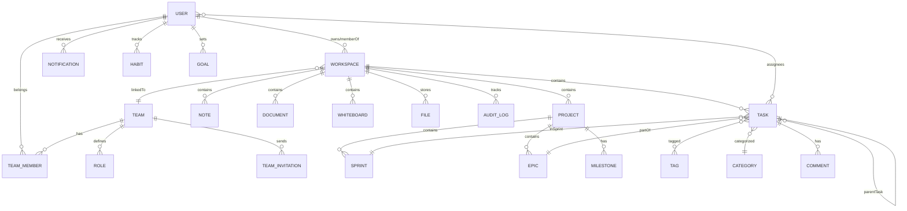
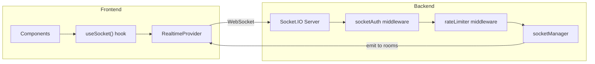

# TaMaD Complete Learning Knowledge Base — Part 2: Deep Systems

> Continuing from Part 1. This part covers authentication, authorization, database, caching, real-time, validation, notifications, file storage, background jobs, AI, analytics, and teams — the core systems that make TaMaD work.

---

## 13 — Authentication: The Complete Lifecycle

### Why the Hybrid Approach?

TaMaD does NOT use Firebase Auth alone or JWT alone. It uses **both**, chained together:

```
Firebase Auth (client-side) → ID Token → Backend verifies → Issues own JWTs → Stored in HttpOnly cookies
```

**Why?** Because:
1. Firebase handles the hard parts: password hashing, OAuth providers, email verification, phone auth
2. But Firebase ID tokens expire every hour and require client-side refresh
3. By issuing your own JWTs, the backend controls session duration, supports server-side logout, and can use HttpOnly cookies (which JavaScript can't read — XSS-safe)

### Step-by-Step Login Flow

#### Phase 1: Firebase Client-Side Authentication

File: [firebase.ts (frontend)](file:///d:/TaMaD/frontend/src/services/firebase.ts)

```
User enters email + password on LoginPage
       ↓
signInWithEmailAndPassword(auth, email, password)
       ↓
Firebase servers verify credentials
       ↓
Returns Firebase User object with ID token
       ↓
const idToken = await user.getIdToken()
       ↓
POST /api/v1/auth/firebase/session { idToken }
```

#### Phase 2: Backend Session Creation

File: [authController.ts](file:///d:/TaMaD/backend/src/controllers/authController.ts)

The `createFirebaseSession` function does ALL of this:

```typescript
// Step 1: Verify the Firebase ID token
const decodedToken = await getFirebaseAuth().verifyIdToken(idToken);
// decodedToken contains: uid, email, name, email_verified, etc.

// Step 2: Find or create the user in MongoDB
let user = await User.findOne({ firebaseUid: decodedToken.uid });
if (!user) {
  user = await User.create({
    name: decodedToken.name || decodedToken.email?.split('@')[0] || 'User',
    email: decodedToken.email,
    firebaseUid: decodedToken.uid,
    role: 'user',
  });
}

// Step 3: Generate TWO JWTs
const accessToken = jwt.sign(
  { id: user._id.toString(), role: user.role },
  process.env.JWT_SECRET,
  { expiresIn: '15m' }   // SHORT-LIVED: 15 minutes
);

const refreshToken = jwt.sign(
  { id: user._id.toString() },
  process.env.JWT_REFRESH_SECRET || process.env.JWT_SECRET,
  { expiresIn: '7d' }    // LONG-LIVED: 7 days
);

// Step 4: Store refresh token hash in database (for server-side revocation)
user.sessions.push({
  tokenHash: crypto.createHash('sha256').update(refreshToken).digest('hex'),
  expiresAt: new Date(Date.now() + 7 * 24 * 60 * 60 * 1000),
});
await user.save();

// Step 5: Set HttpOnly cookies
res.cookie('tamad_access_token', accessToken, {
  httpOnly: true,         // JavaScript CANNOT read this cookie
  secure: true,           // Only sent over HTTPS
  sameSite: 'lax',        // CSRF protection
  maxAge: 15 * 60 * 1000, // 15 minutes
});

res.cookie('tamad_refresh_token', refreshToken, {
  httpOnly: true,
  secure: true,
  sameSite: 'lax',
  maxAge: 7 * 24 * 60 * 60 * 1000, // 7 days
});
```

> [!IMPORTANT]
> **Why TWO tokens?** The access token is short-lived (15 min) so if it's stolen, the damage window is small. The refresh token lives 7 days but is ONLY used to get new access tokens — never sent to other endpoints.

#### Phase 3: Automatic Token Refresh

When the access token expires, the Axios interceptor in [api.ts](file:///d:/TaMaD/frontend/src/utils/api.ts) catches the 401 error:

```
1. Any API call returns 401 (expired access token)
2. Interceptor calls POST /api/v1/auth/refresh
3. Backend reads refresh_token cookie → verifies → checks hash in DB
4. Issues NEW access token cookie + optionally rotates refresh token
5. Interceptor retries the ORIGINAL request automatically
6. User never sees anything — seamless experience
```

#### Phase 4: Logout

```
POST /api/v1/auth/logout
  → Reads refresh token from cookie
  → Removes matching session from User.sessions array
  → Clears both cookies
  → User is logged out on THIS device

POST /api/v1/auth/logout-all
  → Empties entire User.sessions array
  → Clears cookies
  → ALL devices are logged out immediately
```

### Session Storage Model

Sessions are stored **inside the User document** as an array:

```typescript
// In User model:
sessions: [{
  tokenHash: String,    // SHA-256 hash of refresh token (never store raw tokens!)
  device: String,       // Browser/device info
  ip: String,           // IP address
  createdAt: Date,
  expiresAt: Date,
}]
```

**Why in-document?** Because sessions are always queried alongside the user. No need for a separate collection. The `getSessions` endpoint lets users see all their active sessions, and `revokeSession` removes a specific one.

### Auth Methods Supported

| Method | Frontend Page | How It Works |
|--------|-------------|-------------|
| Email + Password | [LoginPage.tsx](file:///d:/TaMaD/frontend/src/pages/auth/LoginPage.tsx) | `signInWithEmailAndPassword()` |
| Email Registration | [RegisterPage.tsx](file:///d:/TaMaD/frontend/src/pages/auth/RegisterPage.tsx) | `createUserWithEmailAndPassword()` |
| Google OAuth | LoginPage.tsx | `signInWithPopup(auth, googleProvider)` |
| GitHub OAuth | LoginPage.tsx | `signInWithPopup(auth, githubProvider)` |
| Phone Number | [PhoneLoginPage.tsx](file:///d:/TaMaD/frontend/src/pages/auth/PhoneLoginPage.tsx) | `signInWithPhoneNumber()` + RecaptchaVerifier |
| Password Reset | [ForgotPasswordPage.tsx](file:///d:/TaMaD/frontend/src/pages/auth/ForgotPasswordPage.tsx) | `sendPasswordResetEmail()` (Firebase handles email) |

---

## 14 — Authorization: Three-Layer RBAC

### Layer 1: Generic Auth — `protect` middleware

File: [auth.ts](file:///d:/TaMaD/backend/src/middleware/auth.ts)

```typescript
export const protect = async (req: AuthRequest, res: Response, next: NextFunction) => {
  const token = req.cookies.tamad_access_token;  // Read from HttpOnly cookie
  if (!token) return res.status(401).json({ error: 'Not authenticated' });
  
  const decoded = jwt.verify(token, process.env.JWT_SECRET);
  const user = await User.findById(decoded.id).select('-sessions');
  if (!user) return res.status(401).json({ error: 'User not found' });
  
  req.user = user;  // Attach user to request — available in ALL downstream handlers
  next();
};
```

**What this does**: Ensures the person making the request is a real, logged-in user. Doesn't check WHAT they can do — just WHO they are.

### Layer 2: Workspace Membership — `workspaceAuth.ts`

File: [workspaceAuth.ts](file:///d:/TaMaD/backend/src/middleware/workspaceAuth.ts)

```typescript
export const requireWorkspaceMember = async (req: AuthRequest, res: Response, next: NextFunction) => {
  // Read workspaceId from body, query, or params
  const workspaceId = req.body.workspaceId || req.query.workspaceId || req.params.workspaceId;
  if (!workspaceId) return next();  // Some routes don't need workspace context

  const workspace = await Workspace.findById(workspaceId);
  if (!workspace) return res.status(404).json({ error: 'Workspace not found' });

  const isMember = workspace.members.some(
    m => m.userId.toString() === req.user._id.toString()
  );
  if (!isMember) return res.status(403).json({ error: 'Not a member of this workspace' });

  next();
};
```

**What this prevents**: **IDOR (Insecure Direct Object Reference)**. Without this, User A could guess User B's workspace ID and access their data. This middleware ensures you can only access workspaces you actually belong to.

### Layer 2b: Entity-Level Workspace Check — `requireEntityWorkspaceMember`

```typescript
export const requireEntityWorkspaceMember = (Model: any) => {
  return async (req: AuthRequest, res: Response, next: NextFunction) => {
    const id = req.params.id || req.params.taskId;
    if (!id || !mongoose.Types.ObjectId.isValid(id)) return next();

    const entity = await Model.findById(id).select('workspaceId');
    if (!entity) return res.status(404).json({ error: 'Resource not found' });

    const workspace = await Workspace.findById(entity.workspaceId);
    if (!workspace) return res.status(404).json({ error: 'Workspace not found' });

    const isMember = workspace.members.some(
      m => m.userId.toString() === req.user._id.toString()
    );
    if (!isMember) return res.status(403).json({ error: 'Not a member of this workspace' });

    next();
  };
};
```

**What this does**: For routes like `PUT /api/tasks/:id`, the workspaceId isn't in the URL — it's embedded in the task document. This middleware reads the entity first, extracts its `workspaceId`, then checks workspace membership. This prevents cross-workspace data manipulation.

### Layer 3: Team Membership — `teamAuth.ts`

File: [teamAuth.ts](file:///d:/TaMaD/backend/src/middleware/teamAuth.ts)

Works identically to workspace auth but checks the `TeamMember` collection and validates the user's team role.

### Role Hierarchy

```
Workspace Roles (simple):        Team Roles (rich, stored in DB):
  owner → Full control              Owner → Full access
  admin → Can manage members         Admin → Can manage settings
  member → Can create/edit           Member → Can create/edit
  guest → Read-only (limited)        Viewer → Read-only
```

### How Workspace Roles Are Checked In Controllers

```typescript
// In workspaceController.updateWorkspace:
const memberEntry = workspace.members.find(
  m => m.userId.toString() === req.user._id.toString()
);
if (!memberEntry || !['owner', 'admin'].includes(memberEntry.role)) {
  return res.status(403).json({ error: 'Not authorized' });
}
```

> [!WARNING]
> Role checking is done **inside controllers**, not middleware. This means if you add a new controller and forget the role check, the route will allow ANY workspace member to perform the action. A middleware-based approach would be safer.

---

## 15 — Database: MongoDB with Mongoose

### Connection Strategy

File: [db.ts](file:///d:/TaMaD/backend/src/config/db.ts)

```typescript
const MAX_RETRIES = 5;
const RETRY_DELAY_MS = 5000;

for (let attempt = 1; attempt <= MAX_RETRIES; attempt++) {
  try {
    await mongoose.connect(mongoUri, { serverSelectionTimeoutMS: 5000 });
    return;
  } catch (error) {
    if (attempt === MAX_RETRIES) throw new Error('Failed after 5 attempts');
    await new Promise(resolve => setTimeout(resolve, RETRY_DELAY_MS));
  }
}
```

**What this does**: Retries up to 5 times with 5-second delays. Essential for Docker deployments where MongoDB might start after the backend.

### Complete Model Catalog (All 37 Models)

| Model | Primary Keys/Indexes | Belongs To | Purpose |
|-------|---------------------|-----------|---------|
| **User** | `firebaseUid` (unique), `email` (unique) | — | Users with sessions, roles |
| **Workspace** | `ownerId`, `members.userId` | User (owner) | Isolation boundary |
| **Task** | `workspaceId+status+order` (compound) | Workspace | Core work unit |
| **Project** | `workspaceId` | Workspace | Task container |
| **Team** | `slug` (unique) | User (creator) | Group of users |
| **TeamMember** | `teamId+userId` (unique compound) | Team, User | Membership join table |
| **Role** | `teamId+name` (unique compound) | Team | Team roles |
| **TeamInvitation** | `token` (unique) | Team | Invite links |
| **Organization** | `slug` (unique) | User (owner) | Top-level org |
| **Meeting** | `roomCode` (unique) | Workspace | Scheduled meetings |
| **Sprint** | `workspaceId`, `projectId` | Workspace, Project | Agile sprint |
| **Epic** | `workspaceId`, `projectId` | Workspace, Project | Large feature grouping |
| **Note** | `workspaceId` | Workspace | Rich text notes |
| **Document** | `workspaceId` | Workspace | Documents |
| **Whiteboard** | `workspaceId` | Workspace | Collaborative drawing |
| **Goal** | `workspaceId`, `userId` | Workspace, User | Goal tracking |
| **Habit** | `workspaceId`, `userId` | Workspace, User | Habit tracking |
| **File** | `workspaceId` (indexed), `originalName` (text) | Workspace | File metadata |
| **Notification** | `userId+read+createdAt` (compound) | User, Workspace | User notifications |
| **AuditLog** | `workspaceId` | Workspace | Audit trail |
| **Comment** | `taskId` | Task | Task comments |
| **Category** | `workspaceId` | Workspace | Task categories |
| **Tag** | `workspaceId` | Workspace | Task tags |
| **Portfolio** | `workspaceId` | Workspace | Portfolio grouping |
| **Milestone** | `projectId`, `workspaceId` | Project | Project milestones |
| **FocusSession** | `workspaceId`, `userId` | Workspace, User | Pomodoro sessions |
| **Template** | `workspaceId` | Workspace | Task/project templates |
| **Roadmap** | `workspaceId` | Workspace | Roadmap planning |
| **ContactSubmission** | — | — | Public contact form |
| TaMaD Meet models | Various | TaMaD Meet | Video meeting system |

### Entity Relationship Diagram



### Mongoose Schema Patterns Used

#### Pattern 1: Embedded Sub-Documents (Sessions in User)
```typescript
sessions: [{
  tokenHash: { type: String, required: true },
  device: String,
  ip: String,
  createdAt: { type: Date, default: Date.now },
  expiresAt: { type: Date, required: true, index: true },
}]
```
**When to embed**: Data is always accessed with the parent. Sessions are only meaningful in the context of a user.

#### Pattern 2: References (ObjectId)
```typescript
workspaceId: { type: Schema.Types.ObjectId, ref: 'Workspace', required: true, index: true }
```
**When to reference**: Data needs to be queried independently. Tasks exist separately from workspaces.

#### Pattern 3: Compound Indexes
```typescript
// Notification — efficiently query "unread notifications for user X, newest first"
NotificationSchema.index({ userId: 1, read: 1, createdAt: -1 });
```
**Why**: MongoDB can use a single index for queries that filter on `userId`, `read`, and sort by `createdAt` all at once. Without this, Mongo would scan every notification.

#### Pattern 4: Text Indexes (for search)
```typescript
FileSchema.index({ workspaceId: 1, originalName: 'text' });
```
**Why**: Enables `$text` search queries on file names. Only one text index per collection.

---

## 16 — Redis Caching

### Architecture

```
Request → Check Redis cache → HIT → Return cached data
                              ↓ MISS
                     Query MongoDB → Save to Redis → Return data

Write operation → Update MongoDB → Invalidate cache → Socket.IO broadcast
```

### Cache Implementation

File: [cache.ts](file:///d:/TaMaD/backend/src/utils/cache.ts)

```typescript
export const cache = {
  get<T>(key: string): Promise<T | null>        // Read from Redis
  set(key, value, ttl): Promise<void>            // Write to Redis with expiry
  del(key): Promise<void>                        // Delete specific key
  invalidatePattern(pattern): Promise<void>      // Delete all matching keys (e.g., 'tasks:*')
  getOrSet<T>(key, fetcher, ttl): Promise<T>     // Read or compute + cache
};
```

### Cache Key Convention

```typescript
CACHE_KEYS = {
  USER: (id) => `user:${id}`,                   // TTL: 5 min
  WORKSPACE: (userId) => `workspace:${userId}`,   // TTL: 10 min
  TASKS: (wsId, params) => `tasks:${wsId}:${params}`, // TTL: 1 min
  PROJECTS: (wsId) => `projects:${wsId}`,         // TTL: 5 min
  NOTES: (wsId) => `notes:${wsId}`,               // TTL: 2 min
  NOTIFICATIONS_UNREAD: (userId) => `notifications:unread:${userId}`, // TTL: 30 sec
  // ... more
};
```

### Cache Invalidation Strategy

**Write-through invalidation**: Every write operation invalidates related cache entries:

```typescript
// In taskController.createTask:
await cache.invalidatePattern(CACHE_KEYS.TASKS(workspaceId, '*'));
// This deletes ALL cached task queries for this workspace
// Pattern 'tasks:abc123:*' matches 'tasks:abc123:status=todo', 'tasks:abc123:page=2', etc.
```

### Cache Middleware (Response-Level Caching)

File: [cache.ts (middleware)](file:///d:/TaMaD/backend/src/middleware/cache.ts)

```typescript
export const cacheMiddleware = (keyGenerator, ttl = 300) => {
  return async (req, res, next) => {
    if (req.method !== 'GET') return next();  // Only cache GET requests

    const key = keyGenerator(req);
    const cached = await cache.get(key);
    if (cached) return res.json(cached);      // Cache HIT — skip controller entirely

    // Cache MISS — intercept res.json to cache the response
    const originalJson = res.json.bind(res);
    res.json = (body) => {
      cache.set(key, body, ttl);              // Store in Redis before sending
      return originalJson(body);
    };
    next();
  };
};
```

> [!TIP]
> **How this works**: The middleware replaces `res.json()` with a wrapper. When the controller calls `res.json(data)`, it transparently caches the data AND sends it to the client. The controller doesn't know caching exists.

### Redis Configuration

File: [redis.ts](file:///d:/TaMaD/backend/src/config/redis.ts)

```typescript
export const redis = new Redis(redisUrl, {
  maxRetriesPerRequest: 1,    // Don't retry forever — fail fast
  enableOfflineQueue: false,   // Don't queue commands when disconnected
  commandTimeout: 2000,        // 2-second timeout on individual commands
  retryStrategy: (times) => Math.min(times * 50, 2000),  // Exponential backoff
});
```

**Fail-fast design**: If Redis is down, cache operations fail silently (try/catch in cache.ts logs warnings), and the app falls back to direct MongoDB queries. Redis is an optimization, not a requirement.

---

## 17 — Real-time: Socket.IO

### Architecture



### Connection Lifecycle

File: [RealtimeProvider.tsx](file:///d:/TaMaD/frontend/src/providers/RealtimeProvider.tsx)

```
1. User logs in → ProtectedRoute renders → RealtimeProvider mounts
2. RealtimeProvider creates Socket.IO connection with auth token
3. Backend socketAuth middleware verifies JWT from cookie
4. Backend rateLimiter middleware attaches rate limiting to socket
5. Connection established → socket joins `user_${userId}` room
6. Frontend emits 'join_workspace' with active workspace ID
7. Backend verifies workspace membership → joins `workspace_${workspaceId}` room
8. Socket is now receiving events for both personal (user room) and workspace events
```

### Socket Event Catalog

| Event | Direction | Room | Payload | Trigger |
|-------|-----------|------|---------|---------|
| `task_created` | Server→Client | `workspace_${id}` | Full task object | Task creation |
| `task_updated` | Server→Client | `workspace_${id}` | Full task object | Task update/reorder |
| `task_deleted` | Server→Client | `workspace_${id}` | `{ taskId }` | Task deletion |
| `tasks_bulk_updated` | Server→Client | `workspace_${id}` | `{ taskIds, updates }` | Bulk update |
| `tasks_bulk_deleted` | Server→Client | `workspace_${id}` | `{ taskIds }` | Bulk delete |
| `task_assigned` | Server→Client | `user_${userId}` | `{ taskId, taskTitle, assignedBy }` | Assignment |
| `notification_created` | Server→Client | `user_${userId}` | Notification object | Any notification |
| `notification_updated` | Server→Client | `user_${userId}` | `{ notificationId, read }` | Mark read |
| `notification_read_all` | Server→Client | `user_${userId}` | — | Mark all read |
| `notification_deleted` | Server→Client | `user_${userId}` | `{ notificationId }` | Delete notification |
| `workspace_updated` | Server→Client | `workspace_${id}` | Workspace object | Workspace settings change |
| `member_added` | Server→Client | `workspace_${id}` | `{ userId, name, role }` | Member invitation |
| `member_removed` | Server→Client | `workspace_${id}` | `{ userId }` | Member removal |
| `member_role_updated` | Server→Client | `workspace_${id}` | `{ userId, role }` | Role change |
| `presence_update` | Server→Client | `workspace_${id}` | `{ workspaceId, users[] }` | Join/leave/disconnect |
| `user_typing` | Server→Client | `workspace_${id}` | `{ userId, taskId }` | Typing start |
| `user_stopped_typing` | Server→Client | `workspace_${id}` | `{ userId, taskId }` | Typing end |
| `activity_feed_updated` | Server→Client | `workspace_${id}` | AuditLog object | Any audited action |
| `epic_created/updated/deleted` | Server→Client | `workspace_${id}` | Epic object | Epic CRUD |
| `sprint_created/updated/deleted` | Server→Client | `workspace_${id}` | Sprint object | Sprint CRUD |
| `join_workspace` | Client→Server | — | workspaceId string | User switches workspace |
| `leave_workspace` | Client→Server | — | workspaceId string | User leaves workspace |
| `typing_start` | Client→Server | — | `{ workspaceId, taskId }` | User starts typing |
| `typing_end` | Client→Server | — | `{ workspaceId, taskId }` | User stops typing |

### Presence Tracking

File: [socketManager.ts](file:///d:/TaMaD/backend/src/sockets/socketManager.ts)

```typescript
const workspacePresence = new Map<string, Set<string>>();
// Key: workspaceId, Value: Set of userIds currently online

// On join_workspace:
workspacePresence.get(workspaceId).add(userId);
io.to(`workspace_${workspaceId}`).emit('presence_update', {
  workspaceId,
  users: Array.from(workspacePresence.get(workspaceId)),
});

// On disconnect:
for (const workspaceId of joinedWorkspaces) {
  workspacePresence.get(workspaceId).delete(userId);
  // Broadcast updated presence to remaining users
}
```

### Socket Authentication

File: [socketAuth.ts](file:///d:/TaMaD/backend/src/sockets/socketAuth.ts)

Sockets authenticate using the same JWT access token, but read it differently:

```typescript
export const resolveSocketToken = (socket) => {
  let token = socket.handshake.auth?.token;  // From client auth option

  // Client can't read HttpOnly cookie, so fallback to parsing cookie header
  if (!token || token.split('.').length !== 3) {
    token = parseCookies(socket.request.headers.cookie).tamad_access_token;
  }
  return token;
};
```

### Socket Rate Limiting

File: [rateLimiter.ts](file:///d:/TaMaD/backend/src/sockets/rateLimiter.ts)

120 events per minute per socket. Prevents a malicious client from flooding the server:

```typescript
if (limitData.count > MAX_EVENTS_PER_WINDOW) {
  return nextPacket(new Error('Rate limit exceeded. Please slow down.'));
}
```

---

## 18 — Input Validation with Zod

### How Validation Works

File: [validate.ts](file:///d:/TaMaD/backend/src/middleware/validate.ts)

```typescript
export const validate = (schema: ZodSchema) => {
  return (req, res, next) => {
    try {
      req.body = schema.parse(req.body);  // Parse AND replace body with cleaned data
      next();
    } catch (err) {
      if (err instanceof ZodError) {
        return res.status(400).json({
          error: 'Validation failed',
          details: err.errors.map(e => ({
            field: e.path.join('.'),
            message: e.message
          })),
        });
      }
      next(err);
    }
  };
};
```

**Key insight**: `schema.parse()` doesn't just validate — it **replaces** `req.body` with the parsed output. This strips any fields not defined in the schema, preventing mass-assignment attacks.

### Schema Examples

File: [schemas.ts](file:///d:/TaMaD/backend/src/middleware/schemas.ts)

```typescript
// Task creation — strict
export const taskCreateSchema = z.object({
  title: z.string().min(1).max(200),        // Required, 1-200 chars
  status: z.enum(['todo', 'in-progress', 'review', 'done']).optional(),
  priority: z.enum(['urgent', 'high', 'medium', 'low']).optional(),
  workspaceId: z.string(),                   // Required
  assignees: z.array(z.string()).optional(),  // Optional array of IDs
});

// Task update — ALL fields optional (uses .partial())
export const taskUpdateSchema = taskCreateSchema.partial();
```

---

## 19 — Notification System

### How Notifications Are Created

Notifications are created programmatically by other controllers — there is NO "create notification" API for users.

File: [notificationController.ts](file:///d:/TaMaD/backend/src/controllers/notificationController.ts)

```typescript
export const createNotification = async (userId, workspaceId, title, body, type, extra) => {
  // 1. Persist to MongoDB
  const notification = await Notification.create({ userId, workspaceId, title, body, type, ...extra });

  // 2. Invalidate cache
  await cache.del(CACHE_KEYS.NOTIFICATIONS_UNREAD(userId));

  // 3. Push to user in real-time via Socket.IO
  getIO().to(`user_${userId}`).emit('notification_created', { ... });
};
```

### Notification Types

```typescript
type: 'info' | 'warning' | 'success' | 'danger' | 'task_assigned' | 'task_updated' | 'mention' | 'comment' | 'reminder'
```

### Where Notifications Are Triggered

| Trigger | Type | Source File |
|---------|------|-------------|
| Task assigned to user | `task_assigned` | [taskController.ts](file:///d:/TaMaD/backend/src/controllers/taskController.ts#L12-L25) |
| Notification mark read | `notification_updated` | [notificationController.ts](file:///d:/TaMaD/backend/src/controllers/notificationController.ts#L48) |
| All notifications read | `notification_read_all` | Same file |

---

## 20 — File Storage

### Architecture: Split Responsibility

```
Frontend uploads directly to Firebase Storage → then tells backend the URL
Backend stores metadata in MongoDB → generates signed URLs for download
```

### Upload Flow

```
1. Frontend calls POST /api/v1/files/upload-url { fileName, contentType, workspaceId }
2. Backend generates signed upload URL (15-min expiry) using Firebase Admin SDK
3. Frontend uploads file directly to Firebase Storage using the signed URL
4. Frontend calls POST /api/v1/files { originalName, url, storagePath, workspaceId, ... }
5. Backend saves file metadata to MongoDB File collection
```

### Download Flow

```
1. Frontend calls GET /api/v1/files/:id/download-url
2. Backend reads File metadata → generates signed download URL (1-hour expiry)
3. Frontend redirects browser to signed URL
```

### File Stats Aggregation

The `getFileStats` endpoint uses MongoDB aggregation to compute file statistics:

```typescript
File.aggregate([
  { $match: { workspaceId, isArchived: false } },
  { $group: {
    _id: { $switch: {
      branches: [
        { case: { $regexMatch: { input: '$mimeType', regex: /^image\// } }, then: 'images' },
        { case: { $regexMatch: { input: '$mimeType', regex: /pdf/ } }, then: 'pdfs' },
      ],
      default: 'other',
    }},
    count: { $sum: 1 },
    totalSize: { $sum: '$size' },
  }},
]);
```

---

## 21 — Background Jobs

File: [jobs.ts](file:///d:/TaMaD/backend/src/utils/jobs.ts)

Four cron jobs run automatically:

| Schedule | Job | What It Does |
|----------|-----|-------------|
| Every hour (`0 * * * *`) | `cleanupExpiredSessions` | Removes expired refresh token sessions from User documents |
| Daily at 2 AM (`0 2 * * *`) | `cleanupOldNotifications` | Deletes read notifications older than 30 days |
| Every 5 minutes (`*/5 * * * *`) | `cleanupStaleCache` | Flushes entire Redis cache (aggressive!) |
| Daily at 9 AM (`0 9 * * *`) | `checkOverdueTasks` | Logs overdue tasks (doesn't notify yet — only logs) |

> [!WARNING]
> **`cleanupStaleCache` flushes ALL Redis keys every 5 minutes**. This is extremely aggressive and defeats the purpose of caching. In production, this should be removed or changed to only clean specific patterns.

---

## 22 — AI Integration

### Two AI Features

File: [ai.ts](file:///d:/TaMaD/backend/src/utils/ai.ts)

#### 1. Natural Language Task Parsing

```
User types: "Finish the homepage redesign by Friday, it's urgent"
   ↓
POST /api/v1/ai/parse-task { text: "..." }
   ↓
OpenAI gpt-4o-mini with structured output (JSON schema)
   ↓
Returns: { title: "Finish the homepage redesign", priority: "urgent", dueDate: "2026-08-22T..." }
```

#### 2. Workspace Chat

File: [aiController.ts](file:///d:/TaMaD/backend/src/controllers/aiController.ts)

The chat endpoint does **NOT** use OpenAI. It uses keyword matching:

```typescript
if (lowerQuery.includes('summarize')) {
  // Build summary from DB data
} else if (lowerQuery.includes('overdue')) {
  // Find overdue tasks
} else if (lowerQuery.includes('productivity')) {
  // Calculate completion rate
} else {
  // Default help message
}
```

> [!NOTE]
> The workspace chat is a **template-based system**, not actual AI. It queries MongoDB, computes statistics, and returns pre-formatted responses based on keyword detection. This could be upgraded to use OpenAI with the workspace context as a system prompt.

#### 3. Embeddings (Utility Only)

```typescript
export const generateEmbedding = async (text: string): Promise<number[]> => {
  const response = await openai.embeddings.create({
    model: 'text-embedding-3-small',
    input: text,
  });
  return response.data[0].embedding;
};
```

This utility exists but is not currently called by any controller or route.

---

## 23 — Analytics Pipeline

File: [analyticsController.ts](file:///d:/TaMaD/backend/src/controllers/analyticsController.ts)

Six analytics endpoints:

| Endpoint | What It Computes |
|----------|-----------------|
| `GET /api/analytics/summary` | Total/done/todo/overdue task counts, completion rate, streak |
| `GET /api/analytics/trend` | Daily created vs completed tasks over N days |
| `GET /api/analytics/priority` | Task count grouped by priority (MongoDB aggregation) |
| `GET /api/analytics/heatmap` | GitHub-style contribution heatmap (365 days of completed tasks) |
| `GET /api/analytics/tags` | Top 10 tags by usage count (aggregation with `$lookup`) |
| `GET /api/analytics/export/csv` | Export tasks as downloadable CSV |
| `GET /api/analytics/weekly` | 7-day report: created, completed, overdue, by priority, daily activity |

### Streak Calculation (interesting algorithm)

```typescript
// Get completed tasks from last 60 days, sorted newest first
const completedTasks = await Task.find({ status: 'done', updatedAt: { $gte: 60daysAgo } });

// Get unique completion dates
const uniqueDays = [...new Set(completedTasks.map(t => t.updatedAt.toISOString().split('T')[0]))];

// Count consecutive days from today backwards
let streak = 0;
for (let i = 0; i < uniqueDays.length; i++) {
  const actualDate = new Date(uniqueDays[i]);
  const expectedDate = new Date();
  expectedDate.setDate(expectedDate.getDate() - i);

  if (sameDay(actualDate, expectedDate)) {
    streak++;  // This day matches the expected consecutive day
  } else {
    break;     // Gap found — streak ends
  }
}
```

---

## 24 — Team Management

### Team Creation (Transactional)

File: [teamController.ts](file:///d:/TaMaD/backend/src/controllers/teamController.ts)

Team creation uses a **MongoDB transaction** to ensure atomicity:

```typescript
const session = await mongoose.startSession();
session.startTransaction();
try {
  // 1. Create the Team document
  const team = await Team.create([{ name, slug, ... }], { session });

  // 2. Create 4 default roles (Owner, Admin, Member, Viewer)
  const defaultRoles = await ensureDefaultRoles(team._id);

  // 3. Create TeamMember entry for the creator (as Owner)
  await TeamMember.create([{ teamId, userId, roleId: ownerRole._id }], { session });

  // 4. Create a default Workspace for the team
  await Workspace.create([{
    name: `${name} Workspace`,
    type: 'team',
    teamId: team._id,
    ownerId: userId,
    members: [{ userId, role: 'owner' }],
  }], { session });

  await session.commitTransaction();
} catch (error) {
  await session.abortTransaction();  // ALL-or-NOTHING
}
```

**Why a transaction?** If workspace creation fails but the team was already created, you'd have an orphaned team with no workspace. The transaction ensures either everything succeeds or nothing changes.

### Invitation System

```
1. Owner/admin calls POST /teams/:id/invite { email, roleId }
2. Backend generates crypto.randomBytes(32) token, stores in TeamInvitation
3. Sends email with link: https://tamad.app/join?token=abc123...
4. Recipient clicks link → POST /teams/join { token }
5. Backend validates token, creates TeamMember, marks invitation as accepted
6. Socket.IO broadcasts 'member_joined' to team room
```

---

## 25 — Agile/Scrum System

File: [agileController.ts](file:///d:/TaMaD/backend/src/controllers/agileController.ts)

### Sprint Lifecycle

```
planned → active → completed
```

**Rules enforced in code**:
1. Only ONE sprint can be `active` per project at a time
2. When completing a sprint, unfinished tasks are moved to backlog (`sprintId` is removed)

```typescript
// Start sprint — enforce single active sprint
const activeSprint = await Sprint.findOne({ projectId: sprint.projectId, status: 'active' });
if (activeSprint) return res.status(400).json({ error: 'Another sprint is already active' });

// Complete sprint — move unfinished tasks to backlog
await Task.updateMany(
  { sprintId: sprint._id, status: { $ne: 'done' } },
  { $unset: { sprintId: 1 } }  // Remove sprint reference
);
```

### Epics

Simple CRUD with real-time broadcasts. Epics group related tasks within a project.

---

## 26 — Cross-Entity Search

File: [searchController.ts](file:///d:/TaMaD/backend/src/controllers/searchController.ts)

The search queries **7 collections in parallel** using `Promise.all`:

```typescript
const regex = { $regex: query, $options: 'i' };  // Case-insensitive regex

const [tasks, projects, notes, documents, files, habits, goals] = await Promise.all([
  Task.find({ workspaceId, $or: [{ title: regex }, { description: regex }] }).limit(5),
  Project.find({ workspaceId, $or: [{ name: regex }, { description: regex }] }).limit(5),
  Note.find({ workspaceId, $or: [{ title: regex }, { content: regex }] }).limit(5),
  // ... 4 more
]);
```

Results are normalized into a uniform `SearchResult` shape:

```typescript
interface SearchResult {
  id: string;
  type: 'task' | 'project' | 'note' | 'document' | 'file' | 'habit' | 'goal';
  title: string;
  subtitle: string;
  href: string;  // Frontend route to navigate to
}
```

> [!TIP]
> **Performance note**: This fires 7 parallel MongoDB queries with `$regex`. For large datasets, this should use MongoDB text indexes (`$text` search) or a dedicated search engine (Elasticsearch, Meilisearch). The `.limit(5)` prevents runaway queries.
